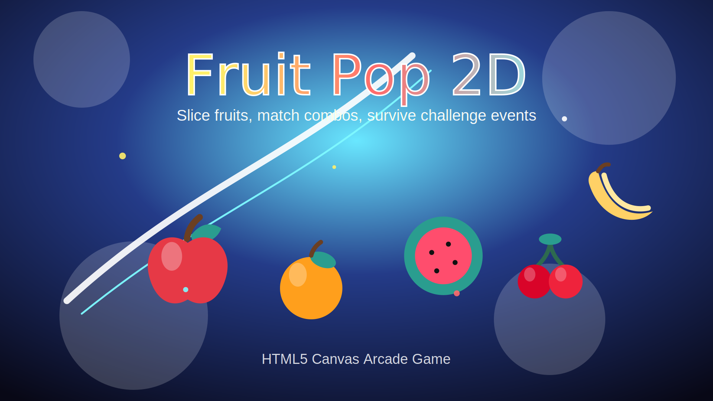

# Fruit Pop 2D

**Fruit Pop 2D** is a colorful HTML5 canvas arcade game about slicing, matching, and collecting juicy fruits before time runs out. The game combines fast Fruit Ninja-style slicing with a casual Match-3 mode inspired by classic candy puzzle games, creating a simple but addictive browser experience that works directly on desktop and mobile.



## Play Online

https://kurotsmile.github.io/fruit-pop-2d/

## Game Overview

In Fruit Pop 2D, players enter a bright arcade world filled with apples, oranges, kiwis, bananas, grapes, cherries, strawberries, and watermelons. Each fruit has its own score value, visual style, and particle effect. The goal is simple: keep scoring, build combos, survive challenge events, and beat your highest score.

The game is designed to feel quick, juicy, and responsive. Every successful slice or match creates colorful particles, score feedback, and combo pressure. If the player stops scoring for too long, the danger timer drops. When it reaches zero, the game ends, keeping the action intense and preventing passive play.

## Game Modes

### Fruit Ninja Slice Mode

Slice fruits as they fly across the screen. Move your mouse or finger through the fruits to cut them, score points, and keep the timer alive. Be careful with bombs because hitting them reduces your score and breaks your combo.

### Match-3 Fruit Mode

Play a fruit-matching puzzle mode where fruits are arranged on a board. Tap a fruit group to clear matching fruit types, gain points, trigger particle effects, and continue building your score.

## Challenge System

Fruit Pop 2D includes special challenge fruits. When a challenge event is triggered, the player must collect a required number of fruits within a short time limit. If the target is not completed before the countdown ends, the game is over.

This system adds extra pressure and makes the game more dynamic as the player progresses. The difficulty increases over time, and fruit speed becomes faster as the score grows.

## Fruit Score Table

| Fruit | Points |
|---|---:|
| Apple | 10 |
| Orange | 12 |
| Kiwi | 16 |
| Banana | 18 |
| Grapes | 22 |
| Cherry | 24 |
| Strawberry | 28 |
| Watermelon | 30 |

## Features

- HTML5 Canvas gameplay
- Fruit Ninja-style slicing mode
- Match-3 fruit puzzle mode
- Unique fruit score values
- Special challenge events
- Increasing difficulty over time
- No-score countdown bar
- Bomb obstacles
- Combo scoring system
- Particle effects and glow effects
- In-game menu UI rendered inside canvas
- In-game Game Over screen
- High score saving with `localStorage`
- CrazyGames SDK bridge with safe fallback
- GitHub Pages ready
- Mobile and desktop friendly

## CrazyGames SDK

The project includes a CrazyGames SDK loader and safe gameplay bridge calls. The game can still run normally on GitHub Pages or any static web host even when the CrazyGames SDK is not available.

Implemented bridge points:

- `gameplayStart()` when a new game starts
- `gameplayStop()` when the game ends
- Safe fallback when running outside CrazyGames

## Controls

Fruit Pop 2D uses a full in-game canvas interface. All buttons, menus, score displays, timers, and Game Over screens are drawn inside the game screen instead of using separate HTML controls. This makes the game feel closer to a real web arcade or mobile game.

### Main Menu Controls

On the main menu, use the mouse on desktop or touch controls on mobile:

| Action | Desktop | Mobile / Tablet | Description |
|---|---|---|---|
| Start Game | Click **Start Game** | Tap **Start Game** | Starts a new round using the selected game mode. |
| Change Mode | Click **Mode** | Tap **Mode** | Switches between **Fruit Ninja Slice** and **Match-3** mode. |
| Toggle Sound | Click **Sound** | Tap **Sound** | Turns game sound on or off. |
| View Fruit Scores | Look at the score table | Look at the score table | Shows each fruit type and how many points it gives. |

### Fruit Ninja Slice Mode Controls

In Slice Mode, fruits fly upward across the screen. The player must slice them before they disappear.

| Action | Desktop | Mobile / Tablet | Result |
|---|---|---|---|
| Slice Fruit | Hold and drag the mouse through a fruit | Swipe through a fruit | Cuts the fruit and adds score. |
| Build Combo | Slice fruits quickly without missing | Swipe through multiple fruits | Increases combo and bonus points. |
| Avoid Bombs | Do not drag through bombs | Do not swipe through bombs | Prevents score loss and combo reset. |
| Trigger Challenge | Slice the special challenge fruit | Swipe the special challenge fruit | Starts a timed fruit target mission. |
| Keep Timer Alive | Continue scoring | Continue scoring | Refills the no-score countdown bar. |

Tips for Slice Mode:

- Try to slice several fruits in one continuous swipe.
- Avoid bombs even if they appear close to valuable fruits.
- Watch the no-score countdown bar. If you stop scoring for too long, the game ends.
- Special challenge fruits are risky but can create higher scoring opportunities.

### Match-3 Mode Controls

In Match-3 Mode, fruits appear on a board. The player taps or clicks fruit icons to clear matching fruit types and score points.

| Action | Desktop | Mobile / Tablet | Result |
|---|---|---|---|
| Select Fruit | Click a fruit tile | Tap a fruit tile | Clears matching fruit types from the board. |
| Score Points | Clear fruits | Clear fruits | Adds points based on the fruit type. |
| Build Combo | Clear fruits repeatedly | Tap quickly and strategically | Increases combo count. |
| Complete Challenge | Clear enough target fruits before time ends | Tap matching fruits quickly | Prevents instant Game Over. |
| Refill Timer | Keep clearing fruits | Keep clearing fruits | Restores the no-score countdown bar. |

Tips for Match-3 Mode:

- Higher-value fruits such as Watermelon, Strawberry, Cherry, and Grapes give more points.
- When a challenge is active, focus on clearing fruits quickly instead of waiting.
- The game rewards fast decisions because the no-score timer keeps dropping.
- Clearing larger groups helps challenge progress faster.

### Challenge Event Controls

Challenge events can appear during gameplay or after slicing a special challenge fruit. When active, the HUD shows a target such as:

```text
Challenge: 3/8 fruits in 6s
```

This means you have collected 3 out of 8 required fruits and only 6 seconds remain.

| Goal | What to Do |
|---|---|
| Increase challenge count | Slice fruits in Slice Mode or clear fruits in Match-3 Mode. |
| Beat the challenge timer | Reach the required fruit count before the countdown reaches zero. |
| Avoid failure | Keep scoring aggressively while the challenge is active. |
| Failure condition | If the target is not completed in time, the game immediately goes to Game Over. |

### Game Over Controls

When the game ends, a Game Over panel appears inside the canvas.

| Action | Desktop | Mobile / Tablet | Description |
|---|---|---|---|
| Restart | Click **Play Again** | Tap **Play Again** | Starts a new round. |
| View Score | Read the Game Over panel | Read the Game Over panel | Shows current score and best score. |
| Save Best Score | Automatic | Automatic | Best score is saved locally using `localStorage`. |

### Recommended Play Style

For the best experience, play in fullscreen or a large browser window. On mobile, use quick swipes in Slice Mode and fast taps in Match-3 Mode. The game is designed around speed, pressure, and constant scoring, so the safest strategy is to keep moving, keep slicing, and never let the no-score timer run out.

## Project Structure

```text
fruit-pop-2d/
├── index.html
├── style.css
├── game.js
├── assets/
│   ├── cover/
│   │   └── cover-1920x1080.svg
│   └── fruits/
│       ├── apple.svg
│       ├── orange.svg
│       ├── cherry.svg
│       └── banana.svg
└── README.md
```

## Tech Stack

- HTML5
- CSS3
- Vanilla JavaScript
- Canvas API
- LocalStorage
- CrazyGames SDK bridge

## How to Run Locally

Clone the repository and open `index.html` in a browser, or run a local static server:

```bash
python3 -m http.server 8080
```

Then open:

```text
http://localhost:8080
```

## Deployment

This game is ready for GitHub Pages. Enable GitHub Pages from the repository settings and use:

- Branch: `main`
- Folder: `/ (root)`

The game will be available at:

```text
https://kurotsmile.github.io/fruit-pop-2d/
```

## Future Improvements

- HD fruit sprite sheet
- Fruits sliced into two halves
- Juice splash effects
- Screen shake and slow motion
- Floating score text
- Power-ups and special fruits
- Online leaderboard
- Achievements
- Rewarded ads through CrazyGames
- Cloud save support
- Mobile vibration feedback
- Fullscreen mode

## License

MIT
